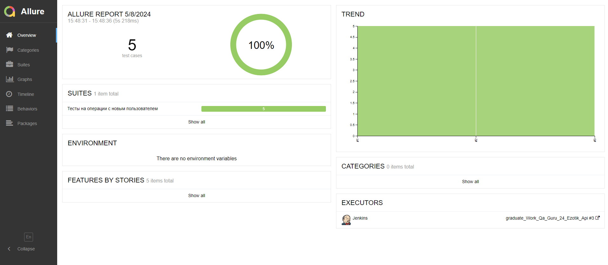

# Проект по тестированию API тестового сайта [Swagger Petstore](https://petstore.swagger.io/#/)
<p align="center">

</p>

## :scroll: Содержание

- [Используемый стек](#computer-используемый-стек)
- [Покрытый функционал](#male_detective-покрытый-функционал)
- [Запуск автотестов](#arrow_forward-запуск-автотестов)
- [Сборка в Jenkins](#-сборка-в-jenkins)
- [Пример Allure-отчёта](#-пример-allure-отчёта)
- [Интеграция с Allure TestOps](#-интеграция-с-allure-testOps)
- [Интеграция с Jira](#-интеграция-с-jira)
- [Уведомления в Telegram с использованием бота](#-уведомления-в-telegram-с-использованием-бота)

## :computer: Используемый стек

<p align="center">


</p>

- [x] Автотесты написаны на языке `Java`;
- [x] В качестве системы контроля версий используется `Git`;
- [x] Для тестирования использованы фреймворки `JUnit 5` и `RestAssured`;
- [x] Инструментом для сборки Java-проекта является `Gradle`;
- [x] Управление удаленным браузером осуществляется с помощью `Selenoid`;
- [x] Для непрерывного выполнения тестовых сценариев используется `Jenkins`;
- [x] По результатам прогона автотестов, с помощью `Allure Report` генерируется отчет, оповещение с результатами тестов и ссылкой на отчет направляется в `Telegram-бот`;
- [x] Для управления тестированием, отслеживания результатов и анализа данных используется `Allure TestOps`;
- [x] Для управления проектом выполнена интеграция `Jira`.  

## :male_detective: Покрытый функционал

- [x] POST запрос на создание нового пользователя в базе данных;
- [x] PUT запрос на редактирование данных по ранее созданному пользователю;
- [x] GET запрос на получение информации по созданному пользователю;
- [x] GET запрос на авторизацию по логин, пароль;
- [x] DELETE запрос на удаление ранее созданного пользователя.


## :arrow_forward: Запуск автотестов

### Запуск тестов из терминала (с параметрами по умолчанию)
```
gradle clean api_test
```
### Запуск тестов на удаленном браузере
```
gradle clean test -Denv=master
```
При необходимости также можно переопределить параметры запуска

```
clean
${TASK}
-Denv=${ENV}
```

### Параметры сборки

* <code>TASK</code> – наименование задачи для запуска автотестов. По-умолчанию - <code>simple_test</code>.
* <code>ENV</code> – загружает конфигурационный файл удалённого запуска, активирующий дополнительные настройки автотестов, которые не используются при локальном запуске.

##  [Сборка](https://jenkins.autotests.cloud/job/graduate_Work_Qa_Guru_24_Ezotik_Api/) в Jenkins

Для запуска сборки необходимо перейти в раздел <code>Build with parameters</code> и нажать кнопку <code>Build</code>.
<p align="center">

</p>
После выполнения сборки, в блоке <code>Build History</code> напротив номера сборки появятся значки <code>Allure Report</code> и <code>Allure TestOps</code>, при клике на которые откроется страница с html-отчетом и тестовой документацией.

##  [Пример](https://jenkins.autotests.cloud/job/graduate_Work_Qa_Guru_24_Ezotik_Api/3/allure) Allure-отчёта

<p align="center">

</p>

### Содержание Allure-отчёта

* Тест-кейсы, разделённые на папки по сьютам;
* Описание шагов тестов;
* Request запрос в каждом шаге с телом запроса Body;
* Status code ответа.

### Раздел Suites

<p align="center">

</p>

### Раздел Behaviors

<p align="center">

</p>

##  [Интеграция](https://allure.autotests.cloud/project/4220/dashboards) с Allure TestOps

На *Dashboard* в <code>Allure TestOps</code> видна статистика количества тестов: сколько из них добавлены и проходятся вручную, сколько автоматизированы. Новые тесты приходят по интеграции при каждом запуске сборки вместе с результатами их прохождения.

<p align="center">

</p>

### Тест-кейсы, сгенерированные из автотестов

<p align="center">

</p>

##  [Интеграция](https://jira.autotests.cloud/browse/HOMEWORK-1216) с Jira

Реализована интеграция <code>Allure TestOps</code> с <code>Jira</code>, в тикете отображаются привязанные тест-кейсы и результаты их запусков.

<p align="center">

</p>

##  Уведомления в Telegram с использованием бота

После завершения сборки специальный бот, созданный в <code>Telegram</code>, получает из Jenkins и отправляет сообщение с отчётом о прогоне тестов.

<p align="center">

</p>


